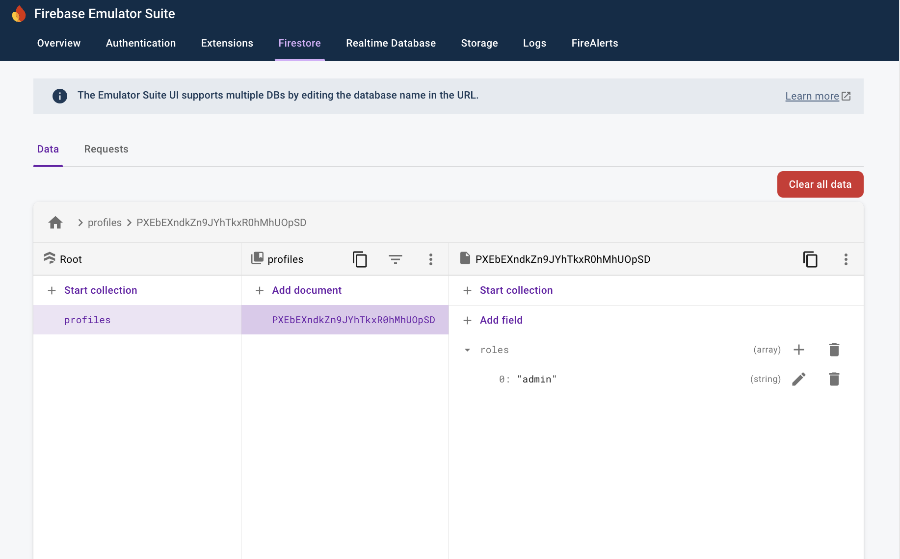

# Repro for issue 7872

## Versions

firebase-tools: v13.23.0<br>
node: v18.19.1

## Steps to reproduce

1. Install dependencies
   - Run `cd functions`
   - Run `npm i`
   - Run `cd ../`
2. Run `firebase emulators:start --project demo-project`
3. In a new terminal, run the curl command below to create a user

```
curl 'http://127.0.0.1:9099/identitytoolkit.googleapis.com/v1/projects/demo-project/accounts' \
 -H 'Authorization: Bearer owner' \
 -H 'Content-Type: application/json' \
 --data-raw '{"customAttributes":"","displayName":"test user","photoUrl":"","email":"test_user@gmail.com","password":"123456","phoneNumber":"","emailVerified":false,"mfaInfo":[]}'
```

4. Terminal runnning the emulator shows the ff:

```
>  Creating admin user... UserRecord {
>    uid: 'PXEbEXndkZn9JYhTkxR0hMhUOpSD',
>    email: 'test_user@gmail.com',
>    emailVerified: false,
>    displayName: 'test user',
>    photoURL: '',
>    phoneNumber: undefined,
>    disabled: false,
>    metadata: UserMetadata {
>      creationTime: 'Tue, 29 Oct 2024 13:38:17 GMT',
>      lastSignInTime: 'Tue, 29 Oct 2024 13:38:17 GMT',
>      lastRefreshTime: null
>    },
>    providerData: [
>      UserInfo {
>        uid: 'test_user@gmail.com',
>        displayName: 'test user',
>        email: 'test_user@gmail.com',
>        photoURL: '',
>        providerId: 'password',
>        phoneNumber: undefined
>      }
>    ],
>    passwordHash: 'fakeHash:salt=fakeSaltt4BDavw5HNhOhrCIY5K4:password=123456',
>    passwordSalt: 'fakeSaltt4BDavw5HNhOhrCIY5K4',
>    tokensValidAfterTime: 'Tue, 29 Oct 2024 13:38:17 GMT',
>    tenantId: undefined
>  }
```

5. Open "http://localhost:4000/firestore/default/data", it should show a document related to the user
   - 
